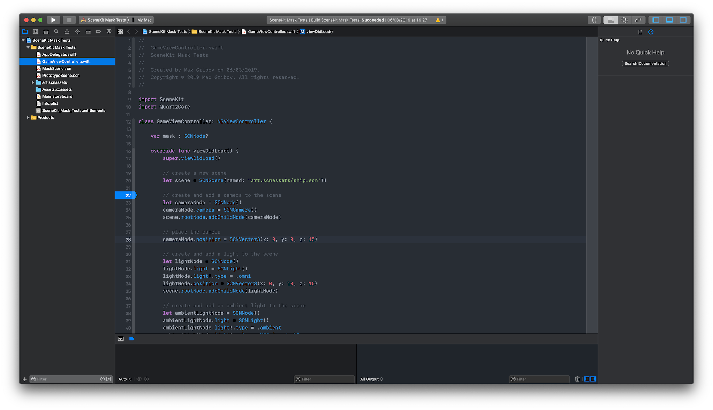

# Atom-One-Xcode
Modified Atom's "One Dark" theme for Xcode

## Setup
```sh
mkdir ~/Library/Developer/Xcode/UserData/FontAndColorThemes/
git clone https://github.com/maxgribov/Atom-One-Xcode.git
cp Atom-One-Xcode/theme/* ~/Library/Developer/Xcode/UserData/FontAndColorThemes/
rm -rf Atom-One-Xcode/
```
## Example

